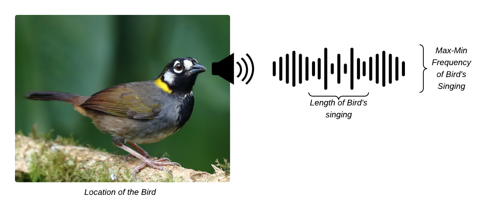
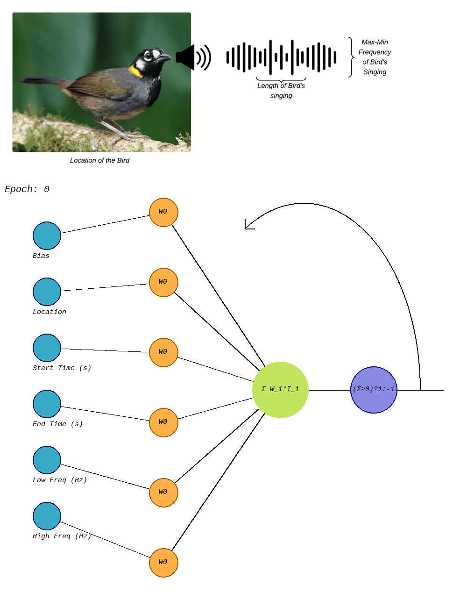

# First-Perceptron

# Summary
A Perceptron is a mimic of a Neuron, it has inputs, process that signals through weights (that are modified by the Perceptron itself to improve the predictions), then a linear function is used to determine if the inputs reach a threshold and finally stablish if the inputs corresponds or not to the individual it was trained to identify.

This is a Simple Perceptron, or Single-Layer Perceptron, capable of being trained with a dataset, or being used with a pre-stablished weights to make predictions over given inputs. It was tested with a couple of datasets,
the Iris Dataset and NES Bird Dataset.

At the end, the use case related to identify the White-Eared Ground-Sparrow is going to be shared as part of the results and conclusions sections.

# Challenges taken

The main challenge taken, is the fact of creating a Perceptron without any library related to Neural Networks. And also, avoiding the usage of Python for this approach, but using C++ in order to ensure none of the existing tools for Perceptron/Data Science/AI are used to achieve the goal.

# Mathematics involved in the Perceptron

Since it is a linear classifier, it is expected that the functions used are linear. But even that, in this section the mathematics inherent to a Perceptron are going to be described, along with the Algorithm used to train and use the Perceptron.

Even this Perceptron is a Single Layer one, it has stages/layers that are going to be described, and they can be summarized as:

1. Inputs
2. Weights
3. Summatory
4. Step function
5. Output

## 1 - Inputs

The problem has to be characterized and analized to extract the main `features` that helps to group the dataset into individuals. Those features need to be transformed into values that could be passed to the Perceptron. For example, when talking about images, all the features extract from it need to be translated to more simple values that a Perceptron can process.

Taking the NES Bird dataset as an example, the main `features` taken to be able to classify all the bird species are: the length of the bird singing (starting and ending seconds from the entire audio clip), the maximum and minimum frequency in Herz and the location.

Those `features` are considered the `inputs` of the Perceptron.

## 2 - Weights

The weights are multiplication factors that helps the perceptron to regulate how important an input is for it to classify the individuals from a dataset.

These values can vary on the way of the training process per `epoch`. Also, they are updated after the Perceptron is given with inputs and forced to predict based on the inputs. If the prediction was not accurately then there is a need to update them, but if the prediction was __correct__ then there is no need to update the Perceptron since it did well.

The decision of update the weights is taken after the __Step function__ section, that is going to be covered in further steps.

## 3 - Sumatory

In this step, the Weights and Inputs are taken to perform a `Dot Product` between these two vectors. 

Lets take the Inputs as:

$$
I = [i_1, i_2, i_3, ..., i_n]
$$

And the Weights as:

$$
W = [w_1,w_2,w_3,...,w_n]
$$

Note that `I` and `W` have the same size `n`.

Then, the dot product between `I` and `W` can be defined as:
$$
I \cdot W = \sum_{i=1}^n I_i \cdot W_i
$$

## 4 - Step Function

This stage takes as input the result of the `Dot Product`, and decide if that prediction is accurate or not based on the expected result, in the training stage.

In the usage of the Perceptron while identifying individuals from the Dataset, this function only returns `1` if the inputs corresponds to the individual it was trained to identify for. It returns `-1` when the inputs do not match with the individual it was trained to identify.

How the error is calculated in the training stage? It is calculated by getting the delta between the expected result and the actual result. The expected result is taken from the dataset, and the actual result of the perceptron is calculated with the `Dot Product`. This difference is multiplied to `eta` ($\eta$) which represents the learning rate.

$$
e = \eta \cdot \left(ŷ - y\right)
$$

If there is no error in the prediction $\left(e = 0\right)$ then there is no need to update the `weights` because the perceptron is predicting accurately. If there is error in the perceptron prediction $\left(e \neq 0\right)$ it means it is needed to update the weights.

The learning process root is right in the way of updating the weights in case of error. The formula takes into consideration the error recently calculated, the current weights and the inputs of the most recent prediction.

$$
W_{new-i} = W_{current-i} + e \cdot I_{i}
$$

where $i > 1$, because the `bias` weight is not taken into consideration when updating the weights.


This formula can be summarized as, the `i-th new weight` corresponds to the current `i-th current weight` plus the error times `i-th input`.

In order to continue training the Perceptron, after this step, it is needed to iterate again through these steps with all training dataset, and also repeat from step 1.

# Loading weights

Once the Perceptron has been trained, this implementation extracts the weights and saves them right under ``bird_detector_statistics/bird_detector_FittestWeights.csv`. So it is possible that the following times using the perceptron there is no need to train it once again, but load the weights and it will be ready to use.

# Use case

The use case is implemented under the file `bird_detection_experiment.cpp`

While searching for datasets to test the perceptron, one related to audio was wide and diverse enough to give a try. It is a collection of recordings of coffee farms in Costa Rica and Colombia. This [dataset](https://zenodo.org/records/7525349) has a variaty of bird singings, but this use case is focusing in three:

1. Chestnut-capped Brushfinch (Colombia)
2. White-tipped Dove (Colombia/Costa Rica)
3. White-eared Ground-Sparrow (Costa Rica)

The Perceptron was trained to identify the `White-eared Ground-Sparrow`:



For this, the `Features` (inputs) taken to train the Perceptron were:

1. Start Time (s)
2. End Time (s)
3. Low Freq (Hz)
4. High Freq (Hz)
5. Location

This is how the Perceptron was evolving through the epochs to finally identify the Individual under test:



The output of the Perceptron when consulting if a bird is a `White-eared Ground-Sparrow` based on the inputs looks like:

```
Consulted bird 0 was White-eared-Ground-Sparrow. Is this bird White-eared Ground-Sparrow ? Perceptron answer: yes
Consulted bird 1 was White-tipped-Dove. Is this bird White-eared Ground-Sparrow ? Perceptron answer: no
Consulted bird 2 was Chestnut-capped-Brushfinch. Is this bird White-eared Ground-Sparrow ? Perceptron answer: no
(...)
```

# Steps to compile the Use case:

You need to go to the root of the repository and simply execute:

Compile it by:

```
make neural_bird_dataset
```

Run the binary by:

```
make run_neural_bird_dataset
```

Clean the binaries:

```
make clean
```

# Further Work

From this project, the idea is to develop a neural network based on layers of instances of this Perceptron.

# References
[1] Álvaro Vega-Hidalgo, Stefan Kahl, Laurel B. Symes, Viviana Ruiz-Gutiérrez, Ingrid Molina-Mora, Fernando Cediel, Luis Sandoval, & Holger Klinck. (2023). A collection of fully-annotated soundscape recordings from neotropical coffee farms in Colombia and Costa Rica (Versión 1) [Data set]. Zenodo. https://doi.org/10.5281/zenodo.7525349

